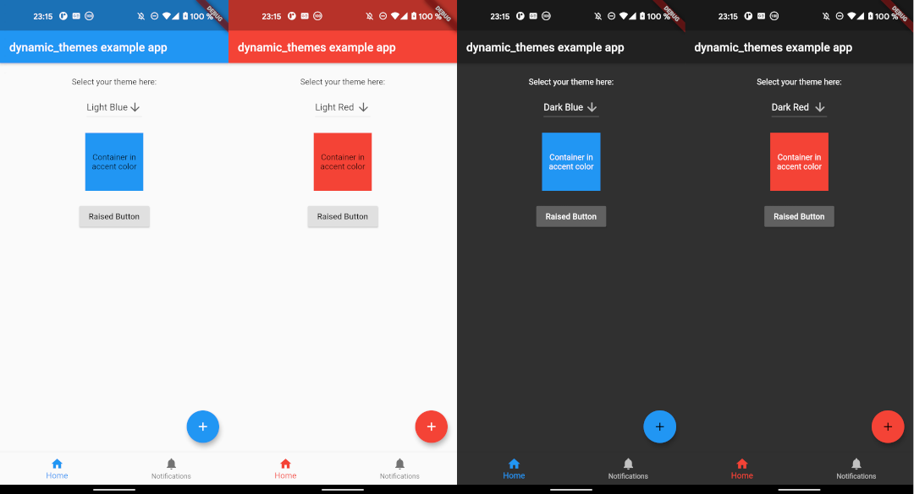

# dynamic_themes

## Dynamically change between multiple themes

This package allows you to specify multiple themes for the user to choose from. The theme can be updated dynamically during runtime. The package persits the selected theme across app restarts.



## Getting Started

Follow the instructions [here](https://pub.dev/packages/dynamic_themes/install).

## Usage

This package allows for an arbitrary number of themes to be defined. Each theme has a unique ID of type `int`. To create the themes and map them to IDs, first you have to create an instance of `ThemeCollection`, e. g.:

```dart
final themeCollection = ThemeCollection(
    themes: {
        0: ThemeData(primarySwatch: Colors.blue),
        1: ThemeData(primarySwatch: Colors.red),
        2: ThemeData.dark(),
    },
    fallbackTheme: ThemeData.light(), // optional fallback theme, default value is ThemeData.light()
);
```

However, I would recommend to introduce a class with `static const int` values to associate a name to each ID value:

```dart

class AppThemes {
    static const int LightBlue = 0;
    static const int LightRed = 1;
    static const int Dark = 2;
}
final themeCollection = ThemeCollection(
    themes: {
        AppThemes.LightBlue: ThemeData(primarySwatch: Colors.blue),
        AppThemes.LightRed: ThemeData(primarySwatch: Colors.red),
        AppThemes.Dark: ThemeData.dark(),
    },
    fallbackTheme: ThemeData.light(),
);
```

Now, wrap your material app like this:

```dart
return DynamicTheme(
    themeCollection: themeCollection,
    defaultThemeId: AppThemes.LightBlue, // optional, default id is 0
    builder: (context, theme) {
        return MaterialApp(
            title: 'dynamic_themes example',
            theme: theme,
            home: HomePage(title: 'dynamic_themes example app'),
        );
    }
);
```

The theme can be set anywhere in the app, provided you have a `BuildContext`, e. g.:

```dart
DynamicTheme.of(context).setTheme(AppThemes.LightRed);
```

By setting the theme, its ID is automatically saved via the [`shared_preferences`](https://pub.dev/packages/shared_preferences) package, so the next time the app starts, the theme can be restored automatically.

Provided you have wrapped the `MaterialApp` in the `DynamicTheme` widget, you can access the current theme like you are used to it by calling

```dart
final theme = Theme.of(context);
```

If for any reason you can't access the theme this way, you can also call

```dart
final theme = DynamicTheme.of(context).theme;
```

To get the ID of the current theme, for example to create a selection UI as done in the example app provided with this package, call

```dart
final themeId = DynamicTheme.of(context).themeId;
```

## Example

The example app can be found in the `example` folder. It implements a dropdown menu to select between 4 themes. The app is the source for the screenshots above.

## Maintainer

* [Julian Aßmann](https://github.com/JulianAssmann)

If you experience any problems using this package, please [create an issue on Github](https://github.com/JulianAssmann/flutter_dynamic_themes/issues). Pull requests are also very welcome.

Many thanks to the [dynamic_theme](https://pub.dev/packages/dynamic_theme) package from [
Norbert Kozsir](https://github.com/Norbert515) this package was inspired by!
